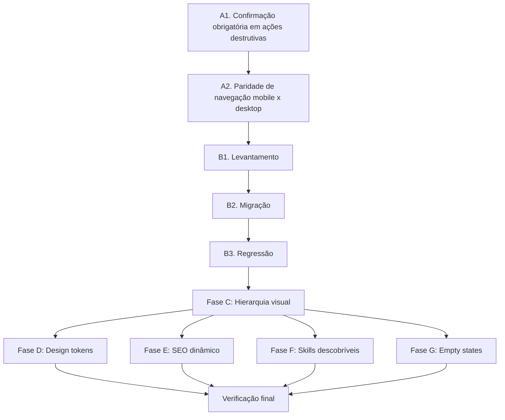

# Implementation Plan: Auditoria UX/Técnica

## Overview

Esta spec consolida correções de uma auditoria UX/técnica focada em fechar o gap entre funcionalidade e usabilidade. Trabalhe em ordem sequencial. Não pule para a fase seguinte sem confirmar que a anterior não quebrou os testes E2E existentes (`npx playwright test`).

## Tasks

## Fase A — P0: risco de dado / paridade quebrada

### A1. Confirmação obrigatória em ações destrutivas

- [x] A1.1. Adicionar `AlertDialog` de confirmação antes de delete de usuário em `AdminDashboard.tsx`
- [x] A1.2. Separar visualmente ação destrutiva (cor, espaçamento ou menu secundário)
- [x] A1.3. Buscar por `onClick.*delete|handleDelete` em AdminDashboard e aplicar mesmo padrão
- [x] A1.4. Testar em mobile (proximidade de toque)
  - Teste reescrito em `client/src/test/mobile-touch-targets.test.tsx`: renderiza `AdminContent`, verifica classes reais de touch target (`min-h-11`, `h-11`, `w-11`) e fluxo do dialog.
- [x] A1.5. Rodar `npx playwright test` completo
  - Validado em 2026-08-14: 33 passed, 9 skipped, sem falhas.
- [x] A1.6. REGRESSÃO: restaurar confirmação por digitação de e-mail no delete de usuário (removida por A1.1)
  - Delete de usuário exige digitar o e-mail exato antes de habilitar a confirmação.

### A2. Paridade de navegação mobile x desktop (Comercial)

- [x] A2.1. Identificar componente de abas do módulo Comercial (`AppNavBar.tsx` ou equivalente)
  - Componente identificado: `client/src/components/CommercialNav.tsx`
  - Análise completa em: `A2.1-analise-comercial-nav.md`
  - 5 abas definidas: Overview, Clients, Pipeline, Propostas, Interações
  - Histórico corrigido em A2.4: mobile deixou de depender de scrollbar horizontal escondido.
- [x] A2.2. Confirmar que desktop mostra 5 abas e mobile mostra 3
  - Premissa da spec estava errada: mobile 375px mostra 2 (não 3), com as 5 no DOM via scroll
  - Histórico corrigido em A2.4: desktop/tablet mostram as 5 abas diretamente; mobile usa dropdown com as 5 seções.
- [x] A2.3. Implementar menu "mais" (overflow) ou migrar para `ResponsiveTabs`
- [x] A2.4. Verificar que todas as 5 seções são acessíveis em ≤2 toques no mobile
  - `tests/e2e/commercial-nav-visibility.spec.ts` confirma 5 seções no dropdown mobile e acesso em até 2 toques; desktop/tablet mostram as 5 abas diretamente.
- [x] A2.5. Rodar `npx playwright test --grep "@fase1"` (mobile)
  - Resultado em 2026-08-14: 6 passed, 6 skipped.

## Fase B — P1: terminar migração mobile

### B1. Levantamento

- [x] B1.1. Rodar `grep -rl "className=\"flex.*border-b\|role=\"tab\"" client/src/pages client/src/components`
  - Resultado bruto em 2026-08-14: 24 arquivos. A busca pega também headers/modais com `border-b`, então foi cruzada com `TabsList`, `ResponsiveTabs`, `overflow-x-auto`, `activeTab` e `nav`.
- [x] B1.2. Gerar lista de ~24 arquivos com abas manuais
  - Bruto do grep: `Projects.tsx`, `Webhooks.tsx`, `Equipment.tsx`, `ShotList.tsx`, `CompanySettings.tsx`, `Analytics.tsx`, `Pipeline.tsx`, `Profile.tsx`, `Documents.tsx`, `Dre.tsx`, `Interactions.tsx`, `ClientDetail.tsx`, `Budget.tsx`, `Clients.tsx`, `Timesheet.tsx`, `ConfirmDialog.tsx`, `ui/command.tsx`, `StudioShell.tsx`, `landing/Hero.tsx`, `AnimatedModal.tsx`, `QuickActionsMenu.tsx`, `files/StorageTab.tsx`, `AIChatbot.tsx`, `analytics/FinancialModals.tsx`.
  - Triagem: vários itens são apenas separadores visuais, modais ou tabelas. Alvos reais de navegação/tabs para migração estão listados em B2.
- [x] B1.3. Transformar em checklist de migração (arquivo + linha)
  - Critério B2: priorizar fluxos de uso diário e controles que, no mobile, dependem de scroll horizontal invisível, têm touch target abaixo de 44px, ou empilham mais um nível de navegação no topo da tela.

### B2. Migração (expandir conforme lista B1.3)

- [x] B2.1. `client/src/components/ProductionNav.tsx:129` — endurecer navegação de Produção: desktop/tablet com touch target `min-h-11`; mobile dropdown com trigger e itens `min-h-11`; validar acesso a Jobs, Estúdio IA, Aprovações, Arquivos, Documentos, Equipamento, Timesheet, Webhooks e Equipe em ≤2 toques.
  - `client/src/test/ProductionNav.test.tsx` cobre touch target real e navegação mobile em 2 toques para todas as áreas visíveis.
  - Validação em 2026-08-14: `npm run test -- client/src/test/ProductionNav.test.tsx`, `npm run check`, `npx playwright test --grep "@fase1"` (6 passed, 6 skipped).
- [x] B2.2. `client/src/components/ProjectNav.tsx:43` e `client/src/components/ProjectNav.tsx:135` — redesenhar navegação de projeto no mobile: reduzir duas faixas horizontais empilhadas, manter Overview/Orçamento/DRE/Shot List e jornada acessíveis sem scroll escondido.
  - Mobile agora usa dropdown de seção do projeto + dropdown de jornada, ambos com `min-h-11`; desktop mantém as linhas existentes.
  - `client/src/test/ProjectNav.test.tsx` cobre ausência de `overflow-x-auto` no bloco mobile e navegação em 2 toques para seções e etapas.
  - Validação em 2026-08-14: `npm run test -- client/src/test/ProjectNav.test.tsx`, `npm run check`, `npx playwright test --grep "@fase1"` (6 passed, 6 skipped).
- [x] B2.3. `client/src/pages/Profile.tsx:1049` — trocar tabs manuais da conta por `ResponsiveTabs` ou dropdown mobile equivalente, preservando desktop wrap.
  - Mobile usa `select` `min-h-11`; desktop preserva botões existentes sem scroll horizontal.
- [x] B2.4. `client/src/pages/Documents.tsx:774` — migrar tipos de documento para controle mobile-safe; botões atuais usam `py-2` e dependem de `overflow-x-auto`.
  - Mobile usa `select` `min-h-11`; desktop usa botões com `min-h-11` e wrap.
- [x] B2.5. `client/src/pages/FilesUnified.tsx:63` — migrar `TabsList` custom para `ResponsiveTabs`, mantendo All Files/By Project/Storage.
- [x] B2.6. `client/src/components/studio/forms/ChecklistForm.tsx:180` — migrar 6 abas internas do checklist para controle mobile-safe; botões atuais usam `py-1.5` e scroll horizontal.
  - Mobile usa `select` `min-h-11`; desktop usa botões com `min-h-11` e wrap.
- [x] B2.7. `client/src/pages/AnalyticsPremium.tsx:41` — alinhar tabs Dashboards/Relatórios ao padrão `ResponsiveTabs` e touch target mínimo.
  - Validação do lote B2.3-B2.7 em 2026-08-14: `npm run check` e `npm run test -- client/src/test/ProjectNav.test.tsx client/src/test/responsive-tabs.test.tsx client/src/test/appImport.test.ts`.
- [x] B2.8. `client/src/components/studio/ToolSidebar.tsx:72` — auditar rail horizontal de categorias/ferramentas do Studio no mobile; decidir entre dropdown por categoria ou busca/filtro fixo sem esconder ferramentas críticas.
  - Mobile agora usa seletor de categoria + seletor de ferramenta, ambos `min-h-11`; desktop preserva a sidebar vertical.
- [x] B2.9. `client/src/pages/ProjectHub.tsx:457` — revisar header de ações do projeto no mobile; hoje usa `overflow-x-auto` em ação/contexto de alto uso.
  - Timeline visual fica em `sm+`; mobile usa select de etapa com `min-h-11`, levando direto para `/journey/:stage`.
- [x] B2.10. `client/src/pages/Pipeline.tsx:606` e `client/src/pages/Pipeline.tsx:722` — manter board horizontal quando necessário, mas adicionar caminho mobile previsível por estágio/filtro para não depender só de arrastar colunas.
  - Mobile mantém lista empilhada e ganhou seletor de etapa no bloco do pipeline; story steps quebram em grid e botões de mover etapa usam `min-h-11`.
- [x] B2.11. Confirmar que os itens B2.1 a B2.10 seguem o padrão de `AdminDashboard.tsx`/`ResponsiveTabs`: touch target ≥44px, estado ativo claro, sem scroll horizontal invisível para navegação primária, e Playwright cobrindo fluxos críticos.
  - B2.1-B2.10 revisados: navegação primária mobile usa dropdown/select ou lista empilhada; scroll horizontal ficou apenas em tabelas/boards não primários.

### B3. Regressão

- [x] B3.1. Rodar `npx playwright test --grep "@fase1"` após cada lote de migrações
  - Resultado em 2026-08-14 após B2.8-B2.11: 6 passed, 6 skipped.
- [x] B3.2. Rodar suíte completa ao final: `npx playwright test`
  - Validado em 2026-08-14: 33 passed, 9 skipped, sem falhas.

## Fase C — P1: hierarquia visual

- [x] C1. Auditar `CommercialOverview.tsx` (ou equivalente)
  - Achado: header, workflow steps e tabs disputavam o topo no mobile; as tabs já usavam `ResponsiveTabs`, mas os steps pareciam uma segunda navegação dominante.
- [x] C2. Identificar os 3 níveis de navegação empilhados
  - Nível 1: navegação do módulo Comercial/Produção; nível 2: tabs internas do overview/Studio; nível 3: etapas/filtros de funil/jornada.
- [x] C3. Redesenhar hierarquia:
  - [x] Nível 1 (abas de módulo) visualmente dominante
  - [x] Nível 2 (sub-abas) mais discreto (underline fino ou segmented control)
  - [x] Nível 3 (seletor de estágio) como filtro (Select/pill group)
  - `CommercialOverview` compactou workflow steps em grid discreto e limitou a largura visual das tabs; `ProjectTimeline` usa select mobile para etapa.
- [x] C4. Aplicar mesma auditoria em `Studio.tsx`
  - `Studio.tsx` é wrapper; auditoria aplicada em `StudioShell`, `ProjectTimeline` e `ActionToolbar`: timeline horizontal virou select mobile, toolbar passou a usar controles `min-h-11`.
- [x] C5. Testar em mobile e desktop
  - Validação em 2026-08-14: `npm run check`, `npm run test -- client/src/test/appImport.test.ts client/src/test/operationsUx.test.tsx`, `npx playwright test --grep "@fase1"` (6 passed, 6 skipped).
- [x] C6. Rodar `npx playwright test`
  - Validado em 2026-08-14: 33 passed, 9 skipped, sem falhas.

## Fase D — P2: design tokens

- [x] D1. Rodar `grep -rl "#[0-9A-Fa-f]\{6\}" client/src/components client/src/pages`
  - Inventário em 2026-08-14: 40 arquivos encontrados; incluía código de produção, exemplos, testes e documentação de componentes.
- [x] D2. Para cada arquivo, trocar hex por token equivalente
  - Componentes, páginas, exemplos, testes e docs agora usam tokens; dados de canvas, seletor nativo e HTML exportado foram centralizados em `client/src/design-system/color-presets.ts`.
- [x] D3. Adicionar regra de lint (ESLint custom ou script em `npm run check`)
  - `scripts/check-design-tokens.mjs` varre `client/src/components` e `client/src/pages`; `npm run check` executa a regra antes do TypeScript.
- [x] D4. Confirmar que `npm run check` falha com hex novo fora de `design-system/`
  - Validado com fixture temporária contendo `#123456`: o script falhou apontando arquivo e linha; a fixture foi removida antes da verificação final.
- [x] D5. Rodar `npm run check && npm run test`
  - Validado em 2026-08-14: regra de tokens e TypeScript passaram; suíte Vitest completa passou. Avisos preexistentes de `act(...)`, mocks de rede e HTML aninhado não produziram falhas.

## Fase E — P2: SEO dinâmico

- [x] E1. Avaliar `react-helmet-async` (não adicionado: o gerenciador único de metadata já existente foi estendido e a Vercel precisa de HTML no servidor, não de mais uma camada client-only)
- [x] E2. Implementar título/description dinâmico em `/` (rota raiz)
- [x] E3. Implementar título/description dinâmico em `/review/:token`
- [x] E4. Implementar título/description dinâmico em `/proposal/:token`
- [x] E5. Implementar título/description dinâmico em `/meeting/:token`
- [x] E6. Verificar que `scripts/verify-built-html.mjs` continua passando
  - Validado em 2026-08-14: `npm run check`, testes direcionados de metadata e `npm run build` passaram. Vercel recebeu rewrites para renderizar metadata de links públicos válidos antes do bundle; links inválidos, expirados ou revogados recebem shell genérico `noindex` sem vazar título, cliente ou conteúdo.
- [ ] E7. Testar com crawlers/validadores de SEO
  - Depende de preview ou produção publicado: conferir resposta HTML e preview de compartilhamento por `curl`, LinkedIn Post Inspector e WhatsApp. Não foi declarado validado localmente.

## Fase F — P3: skills descobríveis

- [x] F1. Listar todas as skills em `.kiro/skills/`
- [x] F2. Verificar se `AGENTS.md` (raiz) referencia todas elas
- [x] F3. Adicionar entradas faltantes na tabela de skills do `AGENTS.md`

## Fase G — P3: empty states

- [x] G1. Auditar tela Financeiro (e outras) para identificar empty states duplicados
  - Financeiro, Orçamento, DRE, Timesheet, Equipment, Webhooks, Shot List,
    Analytics, Dashboard, Propostas, Interações, Pipeline, Equipe e abas de
    Cliente tinham apresentação vazia duplicada ou variantes de primeiro fluxo.
    Estados compactos dentro de uma ferramenta ativa foram classificados como
    contexto local, não como tela duplicada.
- [x] G2. Criar componente `EmptyState` reutilizável
- [x] G3. Consolidar todos os empty states duplicados usando o componente
  - Ações, passos guiados, conteúdo complementar e movimento reduzido usam o
    mesmo contrato. Pipeline, Video Reviews e gráficos preservam somente seus
    avisos compactos contextuais.
- [x] G4. Documentar padrão em `docs/DESIGN_PATTERNS.md` (se existir)

## Verificação final

- [x] Rodar checklist de "pronto":
  - [x] Nenhuma tela com dois níveis de navegação do mesmo peso visual
  - [x] 0 arquivos com hex literal fora de `design-system/`
  - [x] Paridade funcional mobile/desktop nos módulos auditados
  - [x] `AGENTS.md` referencia todas as skills de `.kiro/skills/`
  - [x] Suíte Playwright completa verde: `npx playwright test`
  - Evidência em 2026-08-14: `npm run check` passou; duas execuções isoladas
    de `@fase1` passaram com 6 testes cada; a suíte Playwright completa passou
    com 33 testes, 9 skips e zero falhas. E7 permanece aberto por exigir
    validação externa de um deployment público.

## Task Dependency Graph

## Notes

- As fases A e B têm risco de regressão real — rodar Playwright completo depois de cada uma
- As fases D em diante são de baixo risco e podem ser paralelizadas
- Seguir padrão de `AdminDashboard.tsx` para todas as migrações de ResponsiveTabs
- Componente `ResponsiveTabs` já existe em `client/src/components/ui/responsive-tabs.tsx`
