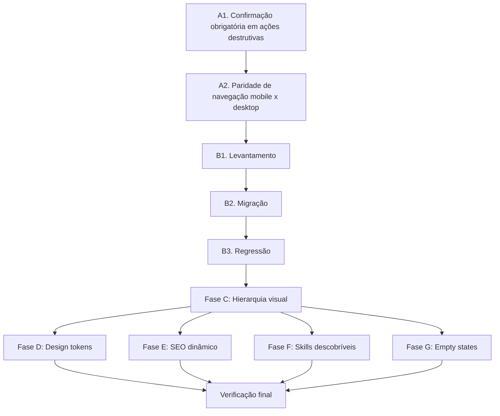

# Implementation Plan: Auditoria UX/Técnica

## Overview

Esta spec consolida correções de uma auditoria UX/técnica focada em fechar o gap entre funcionalidade e usabilidade. Trabalhe em ordem sequencial. Não pule para a fase seguinte sem confirmar que a anterior não quebrou os testes E2E existentes (`npx playwright test`).

## Tasks

## Fase A — P0: risco de dado / paridade quebrada

### A1. Confirmação obrigatória em ações destrutivas

- [x] A1.1. Adicionar `AlertDialog` de confirmação antes de delete de usuário em `AdminDashboard.tsx`
- [x] A1.2. Separar visualmente ação destrutiva (cor, espaçamento ou menu secundário)
- [x] A1.3. Buscar por `onClick.*delete|handleDelete` em AdminDashboard e aplicar mesmo padrão
- [x] A1.4. Testar em mobile (proximidade de toque)
  - Teste reescrito em `client/src/test/mobile-touch-targets.test.tsx`: renderiza `AdminContent`, verifica classes reais de touch target (`min-h-11`, `h-11`, `w-11`) e fluxo do dialog.
- [ ] A1.5. Rodar `npx playwright test` completo
  - ⚠️ Resultado relatado (10 passed / 2 failed) não é verificável: artefatos sobrescritos por rodada posterior. Rodar de novo e guardar evidência.
- [x] A1.6. REGRESSÃO: restaurar confirmação por digitação de e-mail no delete de usuário (removida por A1.1)
  - Delete de usuário exige digitar o e-mail exato antes de habilitar a confirmação.

### A2. Paridade de navegação mobile x desktop (Comercial)

- [x] A2.1. Identificar componente de abas do módulo Comercial (`AppNavBar.tsx` ou equivalente)
  - ✅ Componente identificado: `client/src/components/CommercialNav.tsx`
  - ✅ Análise completa em: `A2.1-analise-comercial-nav.md`
  - ✅ 5 abas definidas: Overview, Clients, Pipeline, Propostas, Interações
  - ⚠️ Usa implementação manual (não ResponsiveTabs)
  - ⚠️ Scrollbar oculto reduz descobribilidade no mobile
- [x] A2.2. Confirmar que desktop mostra 5 abas e mobile mostra 3
  - Premissa da spec estava errada: mobile 375px mostra 2 (não 3), com as 5 no DOM via scroll
  - ⚠️ A2.3 implementado com breakpoint `sm` (640px) removeu Propostas/Interações da barra desktop também; requisito era manter 5 no desktop. Precisa correção.
- [x] A2.3. Implementar menu "mais" (overflow) ou migrar para `ResponsiveTabs`
- [x] A2.4. Verificar que todas as 5 seções são acessíveis em ≤2 toques no mobile
  - `tests/e2e/commercial-nav-visibility.spec.ts` confirma 5 seções no dropdown mobile e acesso em até 2 toques; desktop/tablet mostram as 5 abas diretamente.
- [x] A2.5. Rodar `npx playwright test --grep "@fase1"` (mobile)
  - Resultado em 2026-08-14: 6 passed, 6 skipped.

## Fase B — P1: terminar migração mobile

### B1. Levantamento

- [x] B1.1. Rodar `grep -rl "className=\"flex.*border-b\|role=\"tab\"" client/src/pages client/src/components`
  - Resultado bruto em 2026-08-14: 24 arquivos. A busca pega também headers/modais com `border-b`, então foi cruzada com `TabsList`, `ResponsiveTabs`, `overflow-x-auto`, `activeTab` e `nav`.
- [x] B1.2. Gerar lista de ~24 arquivos com abas manuais
  - Bruto do grep: `Projects.tsx`, `Webhooks.tsx`, `Equipment.tsx`, `ShotList.tsx`, `CompanySettings.tsx`, `Analytics.tsx`, `Pipeline.tsx`, `Profile.tsx`, `Documents.tsx`, `Dre.tsx`, `Interactions.tsx`, `ClientDetail.tsx`, `Budget.tsx`, `Clients.tsx`, `Timesheet.tsx`, `ConfirmDialog.tsx`, `ui/command.tsx`, `StudioShell.tsx`, `landing/Hero.tsx`, `AnimatedModal.tsx`, `QuickActionsMenu.tsx`, `files/StorageTab.tsx`, `AIChatbot.tsx`, `analytics/FinancialModals.tsx`.
  - Triagem: vários itens são apenas separadores visuais, modais ou tabelas. Alvos reais de navegação/tabs para migração estão listados em B2.
- [x] B1.3. Transformar em checklist de migração (arquivo + linha)
  - Critério B2: priorizar fluxos de uso diário e controles que, no mobile, dependem de scroll horizontal invisível, têm touch target abaixo de 44px, ou empilham mais um nível de navegação no topo da tela.

### B2. Migração (expandir conforme lista B1.3)

- [ ] B2.1. `client/src/components/ProductionNav.tsx:129` — endurecer navegação de Produção: desktop/tablet com touch target `min-h-11`; mobile dropdown com trigger e itens `min-h-11`; validar acesso a Jobs, Estúdio IA, Aprovações, Arquivos, Documentos, Equipamento, Timesheet, Webhooks e Equipe em ≤2 toques.
- [ ] B2.2. `client/src/components/ProjectNav.tsx:43` e `client/src/components/ProjectNav.tsx:135` — redesenhar navegação de projeto no mobile: reduzir duas faixas horizontais empilhadas, manter Overview/Orçamento/DRE/Shot List e jornada acessíveis sem scroll escondido.
- [ ] B2.3. `client/src/pages/Profile.tsx:1049` — trocar tabs manuais da conta por `ResponsiveTabs` ou dropdown mobile equivalente, preservando desktop wrap.
- [ ] B2.4. `client/src/pages/Documents.tsx:774` — migrar tipos de documento para controle mobile-safe; botões atuais usam `py-2` e dependem de `overflow-x-auto`.
- [ ] B2.5. `client/src/pages/FilesUnified.tsx:63` — migrar `TabsList` custom para `ResponsiveTabs`, mantendo All Files/By Project/Storage.
- [ ] B2.6. `client/src/components/studio/forms/ChecklistForm.tsx:180` — migrar 6 abas internas do checklist para controle mobile-safe; botões atuais usam `py-1.5` e scroll horizontal.
- [ ] B2.7. `client/src/pages/AnalyticsPremium.tsx:41` — alinhar tabs Dashboards/Relatórios ao padrão `ResponsiveTabs` e touch target mínimo.
- [ ] B2.8. `client/src/components/studio/ToolSidebar.tsx:72` — auditar rail horizontal de categorias/ferramentas do Studio no mobile; decidir entre dropdown por categoria ou busca/filtro fixo sem esconder ferramentas críticas.
- [ ] B2.9. `client/src/pages/ProjectHub.tsx:457` — revisar header de ações do projeto no mobile; hoje usa `overflow-x-auto` em ação/contexto de alto uso.
- [ ] B2.10. `client/src/pages/Pipeline.tsx:606` e `client/src/pages/Pipeline.tsx:722` — manter board horizontal quando necessário, mas adicionar caminho mobile previsível por estágio/filtro para não depender só de arrastar colunas.
- [ ] B2.11. Confirmar que os itens B2.1 a B2.10 seguem o padrão de `AdminDashboard.tsx`/`ResponsiveTabs`: touch target ≥44px, estado ativo claro, sem scroll horizontal invisível para navegação primária, e Playwright cobrindo fluxos críticos.

### B3. Regressão

- [ ] B3.1. Rodar `npx playwright test --grep "@fase1"` após cada lote de migrações
- [ ] B3.2. Rodar suíte completa ao final: `npx playwright test`

## Fase C — P1: hierarquia visual

- [ ] C1. Auditar `CommercialOverview.tsx` (ou equivalente)
- [ ] C2. Identificar os 3 níveis de navegação empilhados
- [ ] C3. Redesenhar hierarquia:
  - [ ] Nível 1 (abas de módulo) visualmente dominante
  - [ ] Nível 2 (sub-abas) mais discreto (underline fino ou segmented control)
  - [ ] Nível 3 (seletor de estágio) como filtro (Select/pill group)
- [ ] C4. Aplicar mesma auditoria em `Studio.tsx`
- [ ] C5. Testar em mobile e desktop
- [ ] C6. Rodar `npx playwright test`

## Fase D — P2: design tokens

- [ ] D1. Rodar `grep -rl "#[0-9A-Fa-f]\{6\}" client/src/components client/src/pages`
- [ ] D2. Para cada arquivo, trocar hex por token equivalente
- [ ] D3. Adicionar regra de lint (ESLint custom ou script em `npm run check`)
- [ ] D4. Confirmar que `npm run check` falha com hex novo fora de `design-system/`
- [ ] D5. Rodar `npm run check && npm run test`

## Fase E — P2: SEO dinâmico

- [ ] E1. Instalar `react-helmet-async` (se não instalado)
- [ ] E2. Implementar título/description dinâmico em `/` (rota raiz)
- [ ] E3. Implementar título/description dinâmico em `/review/:token`
- [ ] E4. Implementar título/description dinâmico em `/proposal/:token`
- [ ] E5. Implementar título/description dinâmico em `/meeting/:token`
- [ ] E6. Verificar que `scripts/verify-built-html.mjs` continua passando
- [ ] E7. Testar com crawlers/validadores de SEO

## Fase F — P3: skills descobríveis

- [ ] F1. Listar todas as skills em `.kiro/skills/`
- [ ] F2. Verificar se `AGENTS.md` (raiz) referencia todas elas
- [ ] F3. Adicionar entradas faltantes na tabela de skills do `AGENTS.md`

## Fase G — P3: empty states

- [ ] G1. Auditar tela Financeiro (e outras) para identificar empty states duplicados
- [ ] G2. Criar componente `EmptyState` reutilizável
- [ ] G3. Consolidar todos os empty states duplicados usando o componente
- [ ] G4. Documentar padrão em `docs/DESIGN_PATTERNS.md` (se existir)

## Verificação final

- [ ] Rodar checklist de "pronto":
  - [ ] Nenhuma tela com dois níveis de navegação do mesmo peso visual
  - [ ] 0 arquivos com hex literal fora de `design-system/`
  - [ ] Paridade funcional mobile/desktop em 100% dos módulos
  - [ ] `AGENTS.md` referencia todas as skills de `.kiro/skills/`
  - [ ] Suíte Playwright completa verde: `npx playwright test`

## Task Dependency Graph

## Notes

- As fases A e B têm risco de regressão real — rodar Playwright completo depois de cada uma
- As fases D em diante são de baixo risco e podem ser paralelizadas
- Seguir padrão de `AdminDashboard.tsx` para todas as migrações de ResponsiveTabs
- Componente `ResponsiveTabs` já existe em `client/src/components/ui/responsive-tabs.tsx`
