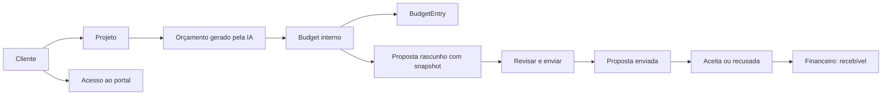

# Design — Fluxos conectados e confiabilidade

## Decisão proposta para aprovação

`Budget` e `Proposal` não serão fundidos. O primeiro representa planejamento e
custo interno por projeto; a segunda é o documento comercial destinado ao
cliente. A ligação é uma referência de origem mais snapshot imutável, porque o
custo pode mudar depois que a oferta foi enviada.

Essa decisão precisa virar ADR antes da migration de R5.

## Fluxo alvo



## Estados e invariantes

| Entidade | Estados | Invariantes |
|---|---|---|
| Orçamento | rascunho operacional | um por projeto; lançamentos nunca são apagados por aplicar novo baseline |
| Proposta | rascunho, enviada, vista, aceita, recusada, revogada | enviada/aceita é versão imutável; apenas novo rascunho ou revisão pode mudar |
| Acesso de cliente | ausente, ativo, inativo | 1:1 com cliente; sessão e senha isoladas da conta da produtora |
| Recebível | previsto, pendente, pago, vencido | nasce apenas de evento comercial explícito, nunca de leitura implícita do orçamento |

## Contrato de dados proposto

```ts
type CommercialSnapshot = {
  version: 1;
  currency: string;
  categories: Array<{ key: string; label: string; quantity?: number; unitPrice?: number; total: number }>;
  subtotal: number;
  tax?: number;
  total: number;
  generatedAt: string;
  source: "ai-budget" | "manual" | "calculator";
};
```

As quantias permanecem em centavos. Texto/HTML é uma representação renderizada
do snapshot, não a única fonte de verdade para editar, exportar ou auditar.

## Arquitetura de informação

| Área | Papel | Conteúdo principal |
|---|---|---|
| Painel | Decisão diária | alertas, pipeline, caixa, jobs e próximos passos |
| Comercial | Receita e relacionamento | clientes, ficha 360, oportunidades, propostas, interações e reuniões |
| Produção | Execução do job | projetos, planejamento, recursos, equipe, timesheet e aprovações |
| Financeiro | Resultado e caixa | recebíveis, despesas, orçamento realizado e DRE por projeto |
| Conta | Pessoa e organização | perfil, segurança, preferências, membros, plano e integrações |

Em Produção, arquivos/documentos/equipamentos ficam em Recursos do Projeto;
equipe e timesheet em Gestão de Equipe; webhooks migram para Conta > Integrações.

## P0: diagnóstico e tratamento de erros

O contrato de orçamento deve responder um payload que permita atualizar a tela
sem depender de estado efêmero:

```ts
type AddBudgetEntryResponse = {
  entry: BudgetEntryRecord;
  overview: BudgetOverview;
};
```

Para cada mutação, a UI usa uma máquina simples: `idle → submitting → success`
ou `idle → submitting → error`. Erro conhecido preserva formulário e escolha;
erro inesperado recebe `requestId` no log e uma mensagem segura na tela.

## Migração e compatibilidade

1. Adicionar colunas nullable e índices à tabela de propostas.
2. Preencher vínculo apenas onde origem puder ser comprovada; registros antigos
   continuam válidos com campos nulos.
3. Criar snapshots apenas quando uma proposta nasce ou recebe revisão, nunca
   inferir retroativamente HTML antigo como fonte financeira confiável.
4. Aplicar via Prisma migration no Supabase e preservar o fallback SQLite em
   desenvolvimento conforme a arquitetura atual.
5. Executar smoke com dados de produção apenas depois de backup aprovado.

## Estratégia de testes

- Unidade: normalização de dinheiro/data, estados de proposta e renderer.
- Integração: orçamento+gasto, bridge IA, criação/revisão de proposta, ownership
  e migração/backfill idempotente.
- E2E: cliente → projeto → orçamento IA → proposta → aceite; desktop e 390px.
- Regressão: portal, proposta pública, DRE, financeiro e produção.
