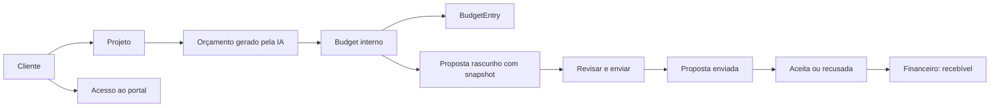

# Design — Fluxos conectados e confiabilidade

## Decisão proposta para aprovação

`Budget` e `Proposal` não serão fundidos. O primeiro representa planejamento e
custo interno por projeto; a segunda é o documento comercial destinado ao
cliente. A ligação é uma referência de origem mais snapshot imutável, porque o
custo pode mudar depois que a oferta foi enviada.

Essa decisão precisa virar ADR antes da migration de R5.

## Fluxo alvo



## Estados e invariantes

| Entidade | Estados | Invariantes |
|---|---|---|
| Orçamento | rascunho operacional | um por projeto; lançamentos nunca são apagados por aplicar novo baseline |
| Proposta | rascunho, enviada, vista, aceita, recusada, revogada | enviada/aceita é versão imutável; apenas novo rascunho ou revisão pode mudar |
| Acesso de cliente | ausente, ativo, inativo | 1:1 com cliente; sessão e senha isoladas da conta da produtora |
| Recebível | previsto, pendente, pago, vencido | nasce apenas de evento comercial explícito, nunca de leitura implícita do orçamento |

## Contrato de dados proposto

```ts
type CommercialSnapshot = {
  version: 1;
  currency: string;
  categories: Array<{ key: string; label: string; quantity?: number; unitPrice?: number; total: number }>;
  subtotal: number;
  tax?: number;
  total: number;
  generatedAt: string;
  source: "ai-budget" | "manual" | "calculator";
};
```

As quantias permanecem em centavos. Texto/HTML é uma representação renderizada
do snapshot, não a única fonte de verdade para editar, exportar ou auditar.

## Arquitetura de informação

| Área | Papel | Conteúdo principal |
|---|---|---|
| Painel | Decisão diária | alertas, pipeline, caixa, jobs e próximos passos |
| Comercial | Receita e relacionamento | clientes, ficha 360, oportunidades, propostas, interações e reuniões |
| Produção | Execução do job | projetos, planejamento, recursos, equipe, timesheet e aprovações |
| Financeiro | Resultado e caixa | recebíveis, despesas, orçamento realizado e DRE por projeto |
| Conta | Pessoa e organização | perfil, segurança, preferências, membros, plano e integrações |

Em Produção, arquivos/documentos/equipamentos ficam em Recursos do Projeto;
equipe e timesheet em Gestão de Equipe; webhooks migram para Conta > Integrações.

## P2: dashboard e financeiro por fonte real

P2 não deve criar métrica sem dono no banco. O Painel vira uma leitura diária
do que já existe, e o Financeiro evolui por fases para separar caixa, recebíveis
e resultado por projeto.

### P2.1 Dashboard proposto

| Bloco | Pergunta que responde | Fonte real atual | Implementação segura |
|---|---|---|---|
| Caixa do mês | Entrou mais do que saiu neste mês? | `financial_entries.kind/status/paid_at/due_date/created_at` via `/api/analytics/finance` | Reusar `summary.receivedMonth`, `summary.expensesMonth` e `summary.profitMonth`. |
| A receber crítico | Quanto está pendente e quanto venceu? | `financial_entries.kind='income'`, `status='pending'`, `due_date` | Reusar `summary.toReceive`, `summary.overdueReceivables` e `pendingEntries`. |
| Pipeline ponderado | Quanto pode virar receita? | `opportunities.estimated_value`, `probability`, `stage` | Reusar `summary.openPipeline` e `summary.weightedPipeline`; não misturar com caixa. |
| Jobs com pressão | Que projeto precisa de ação agora? | `projects.deadline/status/progress`, `project_states`, `video_reviews`, `tasks` | Manter fila operacional do Painel; adicionar finance badges só quando `projectId` existir em lançamento real. |
| Propostas em decisão | Quais propostas precisam de follow-up? | `proposals.status/updated_at/total/project_id/client_id` | Mostrar contagem por status (`sent`, `viewed`, `accepted`, `revoked`) sem transformar aceite em recebível automaticamente. |

O dashboard deve ser compacto: primeiro linha de decisão financeira, depois fila
operacional, depois atalhos. Desktop pode mostrar mais contexto lateral; mobile
mantém uma coluna com cards de 44px+ e sem gráfico que exija precisão de hover.

### P2.2 Financeiro por fases

| Fase | Escopo | Fonte | Não fazer ainda |
|---|---|---|---|
| Fase 1: Caixa | Entradas/saídas reais e pendentes, contas a pagar/receber, recorrência e fluxo mensal. | `financial_entries` já modelado com `kind`, `status`, `dueDate`, `paidAt`, `recurrence`, `clientId`, `opportunityId`, `projectId`. | Não inferir pagamento a partir de proposta aceita. |
| Fase 2: Recebíveis | Criar recebível explicitamente a partir de proposta aceita ou manual, com vencimento, status e vínculo. | `proposals` + novo fluxo que cria `financial_entries.kind='income'` com `proposalId` quando houver coluna/migration aprovada. | Não usar `proposals.total` como caixa nem duplicar receita se já existe lançamento vinculado. |
| Fase 3: Resultado por projeto | Margem por projeto com receita liquidada, custos diretos e despesas alocadas. | `financial_entries.projectId`, `budgets`, `budget_entries`, `dre_settings` e `dreService`. | Não consolidar projetos sem receita/lançamento real como lucro. |

### Lacunas antes da implementação

1. `FinancialEntry` não tem `proposalId`; recebíveis derivados de proposta
   precisam de migration aditiva e backfill nulo.
2. `FinancialEntry` não tem `currency`; hoje o Financeiro assume BRL, enquanto
   `Budget` guarda `currency`. A implementação deve explicitar essa limitação
   ou adicionar campo aditivo antes de multi-moeda.
3. DRE por projeto já calcula resultado com receita liquidada e custos diretos,
   mas depende de lançamentos financeiros vinculados ao `projectId`.
4. Proposta aceita é intenção comercial, não caixa. A virada para recebível
   deve ser uma ação explícita, auditável e reversível.

## P0: diagnóstico e tratamento de erros

O contrato de orçamento deve responder um payload que permita atualizar a tela
sem depender de estado efêmero:

```ts
type AddBudgetEntryResponse = {
  entry: BudgetEntryRecord;
  overview: BudgetOverview;
};
```

Para cada mutação, a UI usa uma máquina simples: `idle → submitting → success`
ou `idle → submitting → error`. Erro conhecido preserva formulário e escolha;
erro inesperado recebe `requestId` no log e uma mensagem segura na tela.

## Migração e compatibilidade

1. Adicionar colunas nullable e índices à tabela de propostas.
2. Preencher vínculo apenas onde origem puder ser comprovada; registros antigos
   continuam válidos com campos nulos.
3. Criar snapshots apenas quando uma proposta nasce ou recebe revisão, nunca
   inferir retroativamente HTML antigo como fonte financeira confiável.
4. Aplicar via Prisma migration no Supabase e preservar o fallback SQLite em
   desenvolvimento conforme a arquitetura atual.
5. Executar smoke com dados de produção apenas depois de backup aprovado.

## Estratégia de testes

- Unidade: normalização de dinheiro/data, estados de proposta e renderer.
- Integração: orçamento+gasto, bridge IA, criação/revisão de proposta, ownership
  e migração/backfill idempotente.
- E2E: cliente → projeto → orçamento IA → proposta → aceite; desktop e 390px.
- Regressão: portal, proposta pública, DRE, financeiro e produção.
