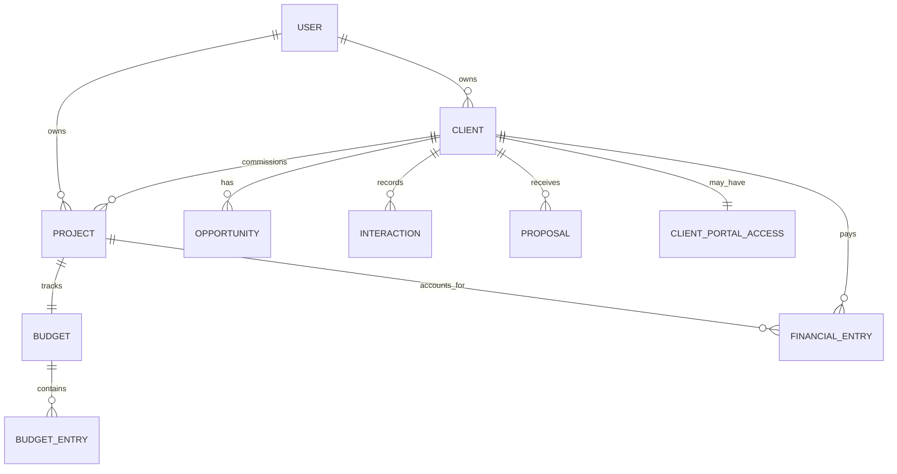

# Requirements — Fluxos conectados e confiabilidade

## Contexto

O Cena já possui as entidades centrais de uma produtora, mas elas não formam
uma jornada contínua. Hoje, `Budget` pertence a um `Project`, enquanto
`Proposal` pertence apenas a um `Client`; não há vínculo de proposta com
projeto, orçamento ou geração da IA. Isso cria duplicação, telas isoladas e
impossibilita rastrear a origem comercial de um valor enviado.

O escopo deste spec é conectar o que já existe e elevar a confiabilidade dos
fluxos críticos, sem remover funcionalidades, dados ou links públicos atuais.

## Mapa de entidades confirmado

**Lacuna confirmada:** `Proposal` não se relaciona com `Project` nem `Budget`.
O vínculo será aditivo: proposta continua comercial e cliente-facing; orçamento
continua interno e operacional. Uma proposta guarda uma referência ao orçamento
de origem e um snapshot imutável dos dados enviados.

## Requisitos

### R1 — Lançamento de gasto confiável (P0)

Como produtora, quero lançar um gasto em um orçamento sem erro genérico e ver
o total atualizado imediatamente, para controlar o resultado do projeto.

#### Critérios de aceite

1. `POST /api/budgets/:projectId/entries` valida projeto, categoria,
   descrição, valor inteiro em centavos, data e URL de comprovante antes de
   alcançar o Prisma.
2. Erros de domínio retornam 4xx com mensagem acionável; erro inesperado recebe
   correlação no log e mensagem segura no cliente, nunca apenas “Internal
   Server Error”.
3. Uma gravação bem-sucedida retorna o lançamento e o overview recalculado na
   mesma resposta ou em atualização explícita imediatamente posterior.
4. Reabrir a tela mantém o lançamento no extrato. O extrato não pode depender
   apenas do estado React da sessão atual.
5. Há testes de serviço, API e fluxo browser para criar gasto e observar valor
   realizado/saldo atualizado.

### R2 — Ponte de orçamento da IA observável (P0)

Como produtora, quero confirmar um orçamento gerado pela IA com feedback
inequívoco e persistência verificável.

#### Critérios de aceite

1. O botão confirma somente quando há projeto, bloco estruturado válido e,
   quando aplicável, reconhecimento explícito de substituição.
2. Durante a gravação, o botão fica ocupado e protegido contra duplo envio.
3. Sucesso mostra confirmação, total aplicado e acesso direto ao orçamento.
4. Falha mantém o diálogo aberto, preserva escolha de faixa e explica o erro.
5. O fluxo E2E cobre piso, teto, substituição, falha da API e persistência após
   navegação/reload.

### R3 — Auditoria de falhas críticas (P0)

Como operador, preciso que Orçamento, Proposta e Produção não escondam falhas
de rede, autorização ou validação.

#### Critérios de aceite

1. Cada mutação desses módulos tem loading, estado desabilitado, sucesso e erro
   visíveis em PT/EN.
2. Cada endpoint valida o input no limite e aplica ownership/escopo de equipe.
3. O relatório de achados fica nesta spec e os itens encontrados viram tasks
   priorizadas, não texto solto de status.

### R4 — Jornada Cliente → Projeto → Acesso (P1)

Como produtora, quero uma etapa explícita para gerar e administrar o acesso do
cliente após seu cadastro, sem misturar a credencial com o CRM.

#### Critérios de aceite

1. A ficha do cliente apresenta uma jornada clara: dados, projeto e acesso ao
   portal, mantendo as ações existentes de `ClientPortalAccess`.
2. Acesso existente pode ser criado, redefinido, ativado ou desativado sem
   expor senha e sem alterar o login da produtora.
3. Mobile, tablet e desktop preservam o mesmo fluxo e os controles têm alvo de
   toque de pelo menos 44px.

### R5 — Orçamento vinculado à proposta (P1)

Como produtora, quero transformar um orçamento aprovado em proposta comercial
sem duplicar dados nem alterar um documento já enviado.

#### Critérios de aceite

1. A migration aditiva permite `Proposal.projectId`, `Proposal.sourceBudgetId`,
   `Proposal.sourceGenerationId` opcional e `Proposal.commercialSnapshot`.
2. O orçamento da IA cria ou atualiza apenas um rascunho associado ao projeto;
   uma proposta enviada/aceita vira uma versão imutável e nunca é sobrescrita.
3. A proposta resultante aparece na ficha do cliente e no Comercial, com origem
   explícita no orçamento/projeto.
4. Dados existentes permanecem legíveis: vínculos novos são nulos para o
   histórico e o backfill é idempotente.

### R6 — Comercial como CRM por cliente (P1)

Como equipe comercial, quero uma ficha 360 do cliente que reúna pipeline,
interações, propostas, reuniões e projetos sem perder contexto.

#### Critérios de aceite

1. A ficha mostra resumo e navegação contextual entre essas superfícies.
2. O Comercial principal conserva visão transversal de pipeline e propostas.
3. Nenhuma ação exige abandonar a ficha apenas para localizar dados daquele
   cliente.

### R7 — Proposta conectada à IA e PDF único (P1)

Como produtora, quero que a IA gere dados editáveis do mesmo documento comercial
e que qualquer exportação use uma identidade Cena consistente.

#### Critérios de aceite

1. A IA entrega um payload estruturado de proposta além do texto de apoio.
2. O gerador comercial edita e salva esse payload na mesma `Proposal`.
3. Orçamento da IA e proposta comercial chamam um único renderer de documento,
   com branding, locale, moeda e dados legais do estúdio.
4. PDFs gerados a partir das duas entradas têm layout e metadados equivalentes.

### R8 — Produção e Conta com lugares coerentes (P1)

Como usuário, quero encontrar cada recurso pela intenção de trabalho, não por
um menu “mais” genérico.

#### Critérios de aceite

1. Produção separa projeto/planejamento, recursos, equipe e tempo.
2. Webhooks e chaves/API vivem em `Conta > Integrações`, não em Produção.
3. A auditoria de Conta compara o que existe hoje com perfil, segurança,
   preferências, notificações, membros/permissões, assinatura e integrações;
   itens ainda não implementados entram em fase posterior, sem afirmação falsa.

### R9 — Painel, Financeiro e linguagem (P2)

#### Critérios de aceite

1. Antes de código, há proposta aprovada de dashboard com KPIs comerciais,
   financeiros e operacionais que tenham fonte de dados real.
2. Antes de código, há plano financeiro em fases: caixa, recebíveis derivados
   de proposta aprovada e despesas/resultados por projeto.
3. “Piso de faixa” e “Teto de faixa” passam a “Valor mínimo” e “Valor máximo”,
   com ajuda contextual PT/EN.

### R10 — Compatibilidade e segurança (transversal)

1. Nenhuma migration remove ou reinterpreta silenciosamente dados atuais.
2. Proposta pública, portal do cliente, DRE e rotas já existentes continuam
   funcionais.
3. Toda alteração tem testes unitários, de API e E2E onde o fluxo é crítico,
   além de verificação mobile quando há UI.
